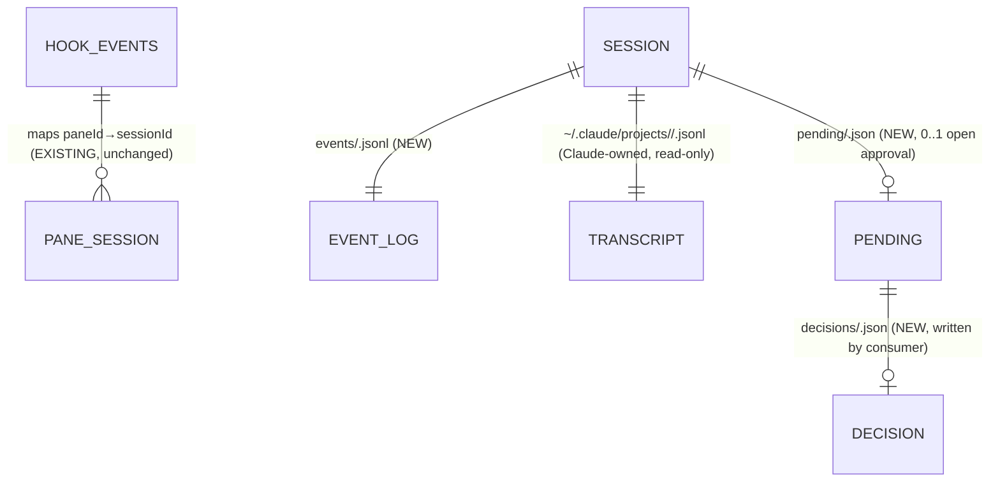

# Data Model — Impl #2 (Camp 1)

Persistence here is **file-state under `~/.config/csm/`**, not a database. The
"schema" is a set of on-disk file formats and their lifecycle. Decision: the new
event log is **additive, separate, and bounded** — it does not touch the existing
truncate-on-read `hook-events` pane-map file (see [`decisions.md`](./decisions.md) ADR-1).

## 1. Entities & relationships



| File | Owner | Lifecycle | Read semantics |
|------|-------|-----------|----------------|
| `~/.config/csm/hook-events` | SessionStart hook (EXISTING) | append by hook, **truncate after read** | `processHookEvents()` — unchanged |
| `~/.config/csm/events/<sessionId>.jsonl` | event hooks (NEW) | append **raw payload** by hook, **atomic trim to last N** | `readEvents()` — **read without truncation** |
| `~/.config/csm/pending/<sessionId>.json` | blocking PreToolUse hook (NEW) | written when detached+blocking; removed on decision/timeout | `listPendingApprovals()` |
| `~/.config/csm/decisions/<sessionId>.json` | consumer (TUI/bridge) (NEW) | written to resolve a pending; consumed+removed by hook | hook poll loop |
| `~/.claude/projects/<enc-cwd>/<id>.jsonl` | Claude Code (read-only) | Claude appends | `parseTranscript()` tail-read |

The event log and the `hook-events` pane-map are **deliberately separate**:
status derivation needs recent edge *history* (read-without-truncate), which is
incompatible with the pane-map's consume-and-truncate contract.

## 2. Constraints & indexes

- **Filename = the index.** `<session_id>` (a UUID, from the payload) keys the
  event log, pending, and decision files — O(1) lookup, no scan. One event log per
  session.
- **Records are the raw hook payload, one JSON object per line, stored verbatim**
  (snake_case `session_id`/`hook_event_name`/…). No normalization layer — this is
  what the contract test feeds `deriveStatus`. **Ordering is append order** (newest
  last); there is no `ts` field and none is needed.
- **Bounded: trimmed to the last 200 lines, only when over budget.** The common
  path is a bare append (the ~5ms A7 measured); trim fires only when
  `wc -l > 200`, amortizing the cost instead of paying a read-rewrite on every
  hook. The trim must be **atomic** — write the tail to
  `events/<session_id>.jsonl.tmp` then `mv -f` over the original (atomic rename on
  the same filesystem). A plain in-place read-truncate-rewrite races the ~3s
  concurrent readers (TUI + monitor) and can expose a zero-byte/partial file;
  `mv -f` makes every read see either the old or new complete file, never a torn one.
  `readEvents` additionally skips any unparseable line (forward/partial-write safety).
  *(A7's 5ms covers append only; if the amortized trim ever shows on the hot path,
  re-measure with the trim step included — see [`decisions.md`](./decisions.md) Open questions.)*
- **One open approval per session** (`pending/<sessionId>.json` is 0..1). A new
  `PreToolUse` while one is pending is not expected (Claude is single-threaded per
  session) but if it occurs the newer request overwrites — last-write-wins.
- **`hook_event_name` ∈** {`SessionStart`, `UserPromptSubmit`, `PreToolUse`,
  `PostToolUse`, `Notification`, `Stop`, `SubagentStop`} (the installed set).
- **Parser tolerance (NOT NULL-style guard):** `parseTranscript` and `readEvents`
  must ignore unknown keys and tolerate a partial/truncated final line (logs and
  transcripts are appended live). Forward-compat with `claude` minor versions.

## 3. Query patterns (concrete — drive the schema)

1. **Last edge for session X** → `readEvents(id)` then take the last record;
   `deriveStatus` maps the edge to status. Hot path, every refresh (~3s) per session.
2. **Recent edges for missed-edge backstop** → last ~10 records of `events/<id>.jsonl`
   to check whether a `PostToolUse`/`tool_result` followed a dangling `PreToolUse`.
3. **All pending approvals** → `listPendingApprovals()` globs `pending/*.json` →
   `[{sessionId, tool, input, ts}]`. Used by TUI Space-menu and (later) the bridge.
4. **Resolve an approval** → `decideApproval(id, "allow"|"deny")` writes
   `decisions/<id>.json`; the blocking hook polls it and returns the permission decision.
5. **Tail transcript for session X** → `parseTranscript(tail(<id>.jsonl))` →
   ordered turns + `lastAssistantMessage` (preview/notification) + resolved
   `AskUserQuestion` options. Pending tool/question come from the **PreToolUse
   event**, not the transcript (SCHEMA A3).

## 4. Sample rows

`events/<session_id>.jsonl` (raw hook payload, one per line, verbatim — matches
`test/fixtures/hooks/*.json`):
```json
{"session_id":"a1b2-...","transcript_path":"/Users/me/.claude/projects/-Users-me-code-app/a1b2-....jsonl","cwd":"/Users/me/code/app","permission_mode":"default","hook_event_name":"PreToolUse","tool_name":"Bash","tool_input":{"command":"rm -rf build"},"tool_use_id":"toolu_01..."}
{"session_id":"a1b2-...","transcript_path":"/Users/me/.claude/projects/-Users-me-code-app/a1b2-....jsonl","cwd":"/Users/me/code/app","hook_event_name":"Notification","notification_type":"permission_prompt","message":"Claude needs your permission"}
```

`pending/<sessionId>.json`:
```json
{"sessionId":"a1b2-...","ts":1750000000456,"tool":"Bash","tool_use_id":"toolu_01...","input":{"command":"rm -rf build","description":"clean build dir"}}
```

`decisions/<sessionId>.json` (written by consumer; hook maps to `permissionDecision`):
```json
{"sessionId":"a1b2-...","tool_use_id":"toolu_01...","decision":"deny","reason":"not now","ts":1750000000999}
```

## 5. Migration plan

No DDL, no locks, no downtime. The migration is **install new hooks + create dirs
lazily**, ordered:

1. **`csm setup` extension** (Inc3): register the six event hooks (`PreToolUse`,
   `PostToolUse`, `UserPromptSubmit`, `Notification`, `Stop`, `SubagentStop`)
   alongside the existing `SessionStart` hook in `~/.claude/settings.json`. Bump
   `HOOK_VERSION`; idempotent (re-run replaces only CSM-managed entries, preserves
   user hooks). Set per-hook `timeout` (default 600s) on the blocking PreToolUse.
2. **Dirs created on first write** by the hook script (`mkdir -p events pending
   decisions`). No pre-provisioning.
3. **Discovery opt-in** (Inc4): `event-status` is used only when
   `events/<sessionId>.jsonl` exists; otherwise scraper fallback. This makes the
   rollout **per-session and gradual** — old sessions keep working untouched.

A7 verified the writer hook adds **~5ms median** — safe on Claude's synchronous
hook path.

## 6. Backwards-compat window

- The existing `hook-events` format and `processHookEvents()` are **unchanged** —
  no dual-write, no view shim needed; the new log is a parallel additive stream.
- **Per-session fallback IS the compat shim:** any session without an event log
  (started before Inc3, or hooks uninstalled) transparently falls back to
  `status.ts` scraping. Mixed fleets are always valid.
- Rollback *during* migration is trivial because event-status is opt-in by file
  presence — see §8.

## 7. Backfill

**N/A — by design (ADR-1).** Event logs are not historical truth; they accrue
going forward as sessions emit hooks. There is nothing to backfill: a session with
no log uses the scraper until its next hook edge writes the first record. This is
the "ephemeral-OK across reboot" decision — logs are real files that survive
reboot, and tmux-resurrect restores the same `sessionId`, so a live session keeps
its log; a stale log for a dead session is garbage-collected (Inc7 rotation).

## 8. Rollback

Per-increment, no data loss:

- **Inc3/Inc4:** revert `csm setup` (lower `HOOK_VERSION` / `csm setup` re-run
  removes the new hooks) → no new event records → discovery finds no logs →
  scraper resumes for all sessions. Optionally `rm -rf ~/.config/csm/events`.
- **Inc6 (approval):** the blocking hook **exits neutral when detached if no
  decision arrives** (600s timeout) and **exits neutral immediately when
  attached** — so removing the hook or the consumer never strands a session; the
  desk TUI prompt always remains the floor. `rm -rf ~/.config/csm/{pending,decisions}`.
- **Inc7:** monitor/notifications revert to viewport-driven transitions (the
  current behavior) by reverting the reconcile commit; no persisted state to undo.
